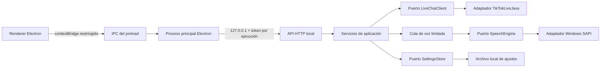

# Live Chat TTS

<p align="center">
  
</p>

<p align="center">Herramienta de escritorio local para Windows que convierte la actividad de un LIVE de TikTok en voz usando las voces instaladas en Windows.</p>

[](README.md)
[](backend/README.es.md)
[](frontend/README.es.md)
[](#requisitos)
[](#arquitectura)

Live Chat TTS es una aplicación de escritorio orientada a la privacidad para creadores y moderadores. Se conecta a un LIVE de TikTok mediante el cliente no oficial TikTokLiveJava, recibe localmente mensajes y eventos compatibles, los coloca en una cola FIFO limitada y los reproduce con Windows SAPI. No necesita un proveedor de TTS en la nube ni un servidor externo de la aplicación.

> TikTokLiveJava es un proyecto no oficial de ingeniería inversa. Revisa su licencia, los términos de TikTok y las reglas aplicables antes de usarlo en un LIVE real. La aplicación funciona como lectora: no envía mensajes, automatiza cuentas, rota IP ni usa cookies.

## Qué incluye

- Conexión a un LIVE de TikTok mediante `uniqueId`.
- Comentarios del chat y eventos compatibles como regalos, nuevos seguidores, suscripciones e inicio, pausa o finalización del LIVE.
- Voces de Windows expuestas por el motor clásico `SAPI.SpVoice`.
- Control de velocidad de voz y selección de salida de audio de Windows.
- Interfaz Electron compacta con estado de conexión, contadores de cola, indicador animado de voz y una vista de actividad de 100 mensajes.
- Modo de prueba local para probar la cola y SAPI sin conectarse a TikTok.
- JAR autocontenido del backend e instalador NSIS de Windows con un runtime reducido de Java 21.

## Arquitectura

El proyecto está separado en las aplicaciones independientes `backend/` y `frontend/`. El backend utiliza arquitectura hexagonal: el dominio y los casos de uso dependen de puertos, mientras HTTP, TikTokLiveJava, Windows SAPI y el almacenamiento de archivos son adaptadores.



### Flujo de ejecución

1. Electron inicia el proceso Java incluido en un puerto loopback disponible y crea un token temporal.
2. El renderer se comunica únicamente mediante los métodos IPC permitidos por el preload.
3. El backend valida y sanea el contenido, aplica límites de frecuencia y coloca los mensajes aceptados en la cola limitada.
4. Un único trabajador secuencial reproduce la voz SAPI seleccionada.
5. El frontend consulta el estado local y muestra conexión, cola, historial de mensajes y estado de reproducción.

## Estructura del repositorio

```text
live-chat-tts/
├── backend/                 # Servicio Java 21, TikTokLiveJava y API HTTP local
├── frontend/                # Aplicación de escritorio Electron
├── BUILDING.md              # Referencia breve de compilación
├── README.md                # Documentación general (inglés)
└── README.es.md             # Este documento (español)
```

Documentación detallada: [backend/README.es.md](backend/README.es.md) y [frontend/README.es.md](frontend/README.es.md). Versiones en inglés: [backend/README.md](backend/README.md) y [frontend/README.md](frontend/README.md).

## Requisitos

- Windows 10/11 x64.
- JDK 21 y Apache Maven 3.9 o superior para compilar el backend.
- Node.js 20 o superior y npm para desarrollar o empaquetar el frontend.
- Internet únicamente para la conexión al LIVE de TikTok. La síntesis de voz se realiza localmente con Windows SAPI.

El instalador empaquetado incluye un runtime reducido de Java 21, por lo que Java no es necesario en el equipo destino.

## Inicio rápido para desarrollo

Primero compila el backend:

```bat
cd backend
build.bat
```

Ejecuta la interfaz de prueba local:

```bat
cd frontend
npm install
test-ui.bat
```

Para un LIVE real, usa `run.bat` después de generar el JAR e introduce el `uniqueId` de TikTok sin `@`.

## Compilación de producción

```bat
cd backend
build.bat

cd ..\frontend
prepare-runtime.bat
npm run dist-win
```

Las salidas son:

- `backend/dist/live-chat-tts.jar`: JAR sombreado con las dependencias de TikTokLiveJava.
- `frontend/dist/Live-Chat-TTS-Setup-<version>.exe`: instalador NSIS de Windows con Electron, el JAR y el runtime reducido de Java.

## Seguridad, privacidad y control de recursos

- La API HTTP del backend se enlaza a `127.0.0.1`; no es un listener público.
- Electron utiliza aislamiento de contexto, Node desactivado en el renderer, sandbox y un puente IPC con lista permitida.
- Un token temporal por ejecución protege la API local cuando Electron inicia el backend.
- No se guardan credenciales, cookies ni tokens en el código.
- La cola tiene capacidad limitada, la voz se reproduce secuencialmente y existen límites deslizantes globales y por autor para proteger CPU, memoria y audio.
- El texto se sanea y limita; el historial del chat solo vive en memoria y se limita a 100 entradas.
- Los ajustes se guardan localmente en `%LOCALAPPDATA%\\LiveChatTTS` por defecto.

Esto protege la aplicación local frente a exposición y sobrecarga accidental, pero no puede garantizar que TikTok permita siempre la conexión de un cliente no oficial.

## Limitaciones y uso responsable

La integración depende de TikTokLiveJava y puede requerir actualizaciones si TikTok cambia sus protocolos. El objetivo actual de producción es Windows; la variable de dominio `Platform` permite añadir adaptadores para macOS o Linux en el futuro. El filtro de lenguaje ofensivo no está activo por defecto y puede añadirse como una política local antes de insertar mensajes en la cola.

## Licencia y avisos de terceros

Este proyecto se distribuye bajo la [Licencia MIT](LICENSE). Existe una traducción informativa al español en [LICENSE.es.md](LICENSE.es.md). Electron, Java y Windows SAPI conservan sus respectivas licencias. TikTokLiveJava es una dependencia independiente; conserva sus avisos y revisa la licencia upstream antes de redistribuir.
