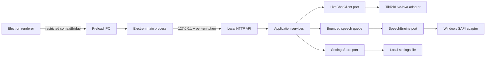

# Live Chat TTS

<p align="center">
  
</p>

<p align="center">A local Windows desktop tool that turns TikTok LIVE activity into speech using the voices installed on Windows.</p>

[](README.es.md)
[](backend/README.md)
[](frontend/README.md)
[](#requirements)
[](#architecture)

Live Chat TTS is a privacy-oriented desktop application for creators and moderators. It connects to a TikTok LIVE through the unofficial TikTokLiveJava client, receives chat and supported LIVE events locally, places speech requests in a bounded FIFO queue, and reads them with Windows SAPI. No cloud TTS provider or external application server is required.

> TikTokLiveJava is an unofficial reverse-engineering project. Review its license, TikTok's terms and applicable rules before using the integration on a real LIVE. The application is a listener: it does not send chat messages, automate accounts, rotate IPs or use cookies.

## What is included

- TikTok LIVE connection by `uniqueId`.
- Chat comments plus supported activity events such as gifts, follows, subscriptions and LIVE lifecycle notifications.
- Windows SAPI voices exposed by the classic `SAPI.SpVoice` engine.
- Voice speed and Windows audio-output selection.
- A compact Electron interface with connection state, queue counters, animated speech indicator and a 100-message activity view.
- A local test mode that exercises the queue and SAPI without connecting to TikTok.
- A self-contained backend JAR and a Windows NSIS installer that bundles a reduced Java 21 runtime.

## Architecture

The project is split into independent `backend/` and `frontend/` applications. The backend follows hexagonal architecture: domain and use cases depend on ports, while HTTP, TikTokLiveJava, Windows SAPI and file storage are adapters.



### Runtime flow

1. Electron starts the bundled Java process on an available loopback port and creates a temporary API token.
2. The renderer communicates only with the allowlisted preload IPC methods.
3. The backend validates and sanitizes content, applies rate limits and places accepted messages in the bounded queue.
4. One sequential speech worker invokes the selected Windows SAPI voice.
5. The frontend polls local status and displays connection, queue, message history and speaking state.

## Repository layout

```text
live-chat-tts/
├── backend/                 # Java 21 service, TikTokLiveJava and local HTTP API
├── frontend/                # Electron desktop application
├── BUILDING.md              # Short build reference
├── README.md                # This document (English)
└── README.es.md             # General documentation (Spanish)
```

Detailed documentation: [backend/README.md](backend/README.md) and [frontend/README.md](frontend/README.md). Spanish versions: [backend/README.es.md](backend/README.es.md) and [frontend/README.es.md](frontend/README.es.md).

## Requirements

- Windows 10/11 x64.
- Java Development Kit 21 and Apache Maven 3.9+ to build the backend.
- Node.js 20+ and npm to develop or package the frontend.
- Internet access only for the TikTok LIVE connection. Speech synthesis is local through Windows SAPI.

The packaged installer includes a reduced Java 21 runtime, so Java is not required on the target computer.

## Quick start for development

Build the backend first:

```bat
cd backend
build.bat
```

Run the offline local test interface:

```bat
cd frontend
npm install
test-ui.bat
```

For a real LIVE, use `run.bat` after the backend JAR has been built and enter the TikTok `uniqueId` without `@`.

## Production build

```bat
cd backend
build.bat

cd ..\frontend
prepare-runtime.bat
npm run dist-win
```

Outputs:

- `backend/dist/live-chat-tts.jar`: shaded backend JAR with TikTokLiveJava dependencies.
- `frontend/dist/Live-Chat-TTS-Setup-<version>.exe`: Windows NSIS installer containing Electron, the JAR and the reduced Java runtime.

## Security, privacy and resource controls

- The backend binds its HTTP API to `127.0.0.1`; it is not a public listener.
- Electron uses context isolation, disabled Node integration, sandboxing and an allowlisted IPC bridge.
- A temporary per-run token protects the local API when launched by Electron.
- No credentials, cookies or tokens are hard-coded.
- The queue is bounded, speech is sequential, and global/per-author sliding-window limits protect CPU, memory and audio resources.
- Text is sanitized and length-limited; chat history is kept in memory only and capped at 100 entries.
- Settings are stored locally under `%LOCALAPPDATA%\\LiveChatTTS` by default.

This protects the local application from accidental exposure and overload; it cannot guarantee that TikTok will always permit an unofficial client connection.

## Limitations and responsible use

The integration depends on TikTokLiveJava and may require updates if TikTok changes its protocols. The current production target is Windows; the `Platform` domain variable leaves room for future macOS/Linux adapters. Offensive-language filtering is not enabled by default and can be added as a local moderation policy before queue submission.

## License and third-party notices

This project is released under the [MIT License](LICENSE). A Spanish convenience translation is available in [LICENSE.es.md](LICENSE.es.md). Electron, Java and Windows SAPI remain subject to their respective licenses. TikTokLiveJava is a separate dependency; retain its notices and review the upstream license before redistribution.
