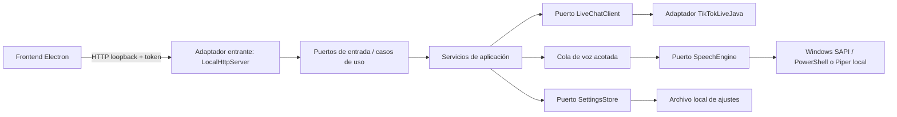

# Live Chat TTS - Backend

<p align="center"></p>

[](README.md)
[](https://openjdk.org/)
[](https://github.com/jwdeveloper/TikTokLiveJava)
[](https://github.com/OHF-Voice/piper1-gpl)
[](#arquitectura)
[](#requisitos)

Servicio local Java 21 que recibe comentarios de TikTok LIVE mediante TikTokLiveJava y los reproduce con Piper local o Windows SAPI. El servicio está diseñado para ser iniciado por el frontend de escritorio Electron y vincula su API HTTP únicamente al loopback.

> TikTokLiveJava es un proyecto no oficial de ingeniería inversa. Revisa su licencia y las reglas de TikTok antes de conectarte a un LIVE real. Este adaptador solo escucha comentarios; no envía mensajes, usa cookies, rota identidades/IP ni implementa bucles agresivos de reconexión.

## Arquitectura

El código usa arquitectura hexagonal. El dominio y los servicios de aplicación no dependen de HTTP, PowerShell ni TikTokLiveJava.



### Capas principales

| Capa | Responsabilidad |
| --- | --- |
| `domain` | Modelos de plataforma, origen del LIVE, estado de conexión y mensajes. |
| `application/port` | Contratos estables de entrada y salida. |
| `application/service` | Ciclo de conexión, saneamiento, límites, cola y validación de ajustes. |
| `adapter/in/http` | API JSON estricta, local y exclusiva para la interfaz. |
| `adapter/out/live` | Implementaciones TikTokLiveJava y prueba local. |
| `adapter/out/windows` | Voces SAPI y salida de audio predeterminada de Windows. |
| `adapter/out/piper` | Trabajador Piper local persistente y reproducción PCM. |
| `bootstrap` | Configuración por entorno y ensamblaje de dependencias. |

## Requisitos

- Windows 10/11 x64.
- JDK 21 para compilar; el instalador de escritorio incluye su propio runtime Java reducido.
- Apache Maven 3.9 o superior.
- Internet únicamente mientras TikTokLiveJava conecta al LIVE; el TTS no usa servicios cloud.

## Configuración

Toda la configuración llega mediante variables de entorno. No se guardan credenciales ni tokens en el código fuente.

| Variable | Predeterminado | Descripción |
| --- | --- | --- |
| `APP_PLATFORM` | `WINDOWS` | Plataforma soportada actualmente. |
| `LIVE_SOURCE` | `LOCAL_TEST` | `LOCAL_TEST` para pruebas offline o `TIKTOK_LIVE_JAVA` para comentarios reales. |
| `TTS_ENGINE` | `PIPER` | `PIPER` de forma predeterminada, o `SAPI` como respaldo explícito. |
| `PIPER_EXECUTABLE` | `backend/piper-native/piper/piper.exe` | Ejecutable nativo portable de Piper. |
| `PIPER_MODEL` | `backend/piper/models/es_MX-claude-high.onnx` | Modelo local de voz Piper. |
| `APP_PORT` | `8787` | Puerto HTTP de loopback, 1024-65535. |
| `LOCAL_API_TOKEN` | vacío | Si se define, las rutas requieren `X-Local-Api-Token`. Electron lo genera por ejecución. |
| `SPEECH_QUEUE_CAPACITY` | `200` | Mensajes pendientes, limitado para proteger la memoria. |
| `APP_DATA_DIR` | `%LOCALAPPDATA%\\LiveChatTTS` | Ubicación de ajustes no sensibles. |

## Compilación y artefactos de producción

Desde `backend\\` en una terminal de Windows:

```bat
winget install Apache.Maven
```

Abre una terminal nueva después de instalar Maven y genera el JAR autocontenido:

```bat
cd path\to\live-chat-tts\backend
build.bat
```

Salida: `dist\\live-chat-tts.jar`. Maven Shade incorpora TikTokLiveJava, JLayer y el MP3 de alerta de regalo incluido; no se requiere una carpeta `lib` adicional.

Prueba offline de extremo a extremo:

```bat
verify-jar.bat
```

Ejecutar una conexión real manualmente (normalmente lo hace Electron):

```bat
set LIVE_SOURCE=TIKTOK_LIVE_JAVA
run-jar.bat
```

## Piper TTS local

Piper está disponible como motor de voz completamente local. El binario portable de Windows y la voz mexicana `es_MX-claude-high` se incluyen para desarrollo y producción:

```bat
Verifica que existan `backend/piper-native/piper/piper.exe` y el modelo.
```

Luego inicia la interfaz desde `frontend\\` con Piper activado:

```bat
test-piper-ui.bat
```

El proceso nativo de Piper permanece activo durante la sesión y se reinicia automáticamente si deja de responder. Piper se selecciona si `TTS_ENGINE` no se define; usa `TTS_ENGINE=SAPI` para el respaldo. No se necesita instalar Python ni un entorno virtual.

Mide el tiempo de síntesis sin reproducir audio:

```bat
benchmark-piper.bat
```

## API local

La API se enlaza a `127.0.0.1` y usa el token temporal cuando Electron la inicia.

| Método | Endpoint | Propósito |
| --- | --- | --- |
| `GET` | `/api/health` | Comprobación básica. |
| `GET` | `/api/status` | Conexión, cola, voz y diagnósticos. |
| `GET` | `/api/voices` | Voces instaladas expuestas por el SAPI clásico de Windows. |
| `GET` | `/api/settings` | Voz, velocidad y salida actuales. |
| `PUT` | `/api/settings` | Actualizar ajustes validados. |
| `POST` | `/api/connect` | Conectar `{ "username": "uniqueId" }`. |
| `POST` | `/api/disconnect` | Cerrar la conexión. |
| `POST` | `/api/test/messages` | Inyectar un evento local solo en `LOCAL_TEST`; acepta `type` opcional como `CHAT` o `GIFT`. |

## Controles de recursos y seguridad

- Cola FIFO con capacidad máxima configurable.
- Un único trabajador secuencial para el motor SAPI o Piper seleccionado; no crea procesos de voz ilimitados.
- Las alertas de regalo se decodifican una vez desde el MP3 incluido y ese mismo trabajador reutiliza su PCM en memoria.
- Límites deslizantes globales y por autor.
- Tamaño máximo, parser JSON estricto y saneamiento del texto.
- Loopback, token temporal y sin CORS ni listener público.
- El contenido del chat no se persiste; solo se guardan ajustes de voz no sensibles.
- Los diagnósticos exponen errores saneados y contadores, nunca tokens ni historial.

## Alertas de regalo

Los regalos y donaciones se leen primero y luego reproducen el MP3 local incluido antes de que la cola FIFO continúe. La alerta se decodifica una vez al iniciar y se reutiliza en memoria.

## Licencia y avisos de terceros

El backend también incluye JLayer bajo LGPL y el MP3 de alerta proporcionado para el proyecto. Piper y su modelo de voz tienen sus propias licencias upstream. Revisa [THIRD_PARTY_NOTICES.md](THIRD_PARTY_NOTICES.md) antes de redistribuirlo.

El código fuente se mantiene en este workspace. TikTokLiveJava es una dependencia MIT independiente; conserva sus avisos al redistribuir el JAR y revisa siempre sus términos actuales.
