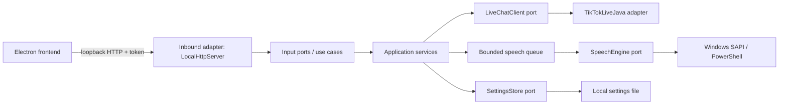

# Live Chat TTS - Backend

<p align="center"></p>

[](README.es.md)
[](https://openjdk.org/)
[](https://github.com/jwdeveloper/TikTokLiveJava)
[](#architecture)
[](#requirements)

Local Java 21 service that receives TikTok LIVE comments through TikTokLiveJava and reads them with Windows SAPI. The service is designed to be launched by the Electron desktop frontend; it binds its HTTP control API to loopback only.

> TikTokLiveJava is an unofficial reverse-engineering project. Review its license and TikTok rules before connecting to a real LIVE. This adapter only listens to comments; it does not send chat messages, use cookies, rotate identities/IPs, or implement aggressive reconnect loops.

## Architecture

The code follows hexagonal architecture. Domain and application services do not depend on HTTP, PowerShell or TikTokLiveJava.



### Main layers

| Layer | Responsibility |
| --- | --- |
| `domain` | Platform, live source, connection state and chat message models. |
| `application/port` | Stable inbound and outbound contracts. |
| `application/service` | Connection lifecycle, sanitization, rate limiting, queueing and settings validation. |
| `adapter/in/http` | Strict, local-only JSON API for the desktop UI. |
| `adapter/out/live` | TikTokLiveJava and local test implementations. |
| `adapter/out/windows` | SAPI voices and the Windows default audio output. |
| `bootstrap` | Environment configuration and dependency wiring. |

## Requirements

- Windows 10/11 x64.
- JDK 21 for building; the packaged desktop installer includes its own reduced Java runtime.
- Apache Maven 3.9+.
- Internet access only while TikTokLiveJava connects to the LIVE; no cloud TTS service is used.

## Configuration

All configuration is supplied through environment variables. No credentials or tokens are stored in source code.

| Variable | Default | Description |
| --- | --- | --- |
| `APP_PLATFORM` | `WINDOWS` | Current supported platform. |
| `LIVE_SOURCE` | `LOCAL_TEST` | `LOCAL_TEST` for offline smoke tests or `TIKTOK_LIVE_JAVA` for real comments. |
| `APP_PORT` | `8787` | Loopback HTTP port, 1024-65535. |
| `LOCAL_API_TOKEN` | empty | If set, API calls require `X-Local-Api-Token`. The Electron parent generates it per run. |
| `SPEECH_QUEUE_CAPACITY` | `200` | Pending messages, bounded to protect memory. |
| `APP_DATA_DIR` | `%LOCALAPPDATA%\\LiveChatTTS` | Non-secret settings location. |

## Build and production artifacts

From `backend\\` in a Windows terminal:

```bat
winget install Apache.Maven
```

Open a new terminal after installation and build the self-contained production JAR:

```bat
cd path\to\live-chat-tts\backend
build.bat
```

Output: `dist\\live-chat-tts.jar`. Maven Shade embeds TikTokLiveJava and its runtime dependencies, so no extra `lib` folder is required.

Run the offline smoke test:

```bat
verify-jar.bat
```

Run a real connection manually (the frontend normally starts this for you):

```bat
set LIVE_SOURCE=TIKTOK_LIVE_JAVA
run-jar.bat
```

## Local API

The API is bound to `127.0.0.1` and protected by the temporary token when launched by Electron.

| Method | Endpoint | Purpose |
| --- | --- | --- |
| `GET` | `/api/health` | Basic health check. |
| `GET` | `/api/status` | Connection, queue, speech and diagnostics. |
| `GET` | `/api/voices` | Installed voices exposed by classic Windows SAPI. |
| `GET` | `/api/settings` | Current voice, rate and output settings. |
| `PUT` | `/api/settings` | Update validated speech settings. |
| `POST` | `/api/connect` | Connect `{ "username": "uniqueId" }`. |
| `POST` | `/api/disconnect` | Close the live connection. |
| `POST` | `/api/test/messages` | Inject a message only in `LOCAL_TEST`. |

## Resource and security controls

- FIFO queue with configurable bounded capacity.
- Single sequential SAPI worker; no unbounded parallel speech processes.
- Global and per-author sliding-window rate limits.
- Message size limits, strict JSON parsing and text sanitization.
- Loopback binding, temporary API token and no CORS/public listener.
- Chat content is not persisted; only non-secret speech settings are stored.
- Diagnostics expose sanitized errors and counters, not tokens or chat history.

## License and third-party notices

The project source is maintained in this workspace. TikTokLiveJava is a separate MIT-licensed dependency; retain its notices when redistributing the production JAR and review the current upstream terms.
