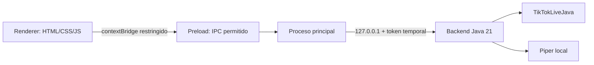

# Live Chat TTS - Frontend de escritorio

<p align="center"></p>

[](README.md)
[](https://www.electronjs.org/)
[](https://nodejs.org/)
[](https://github.com/OHF-Voice/piper1-gpl)
[](https://github.com/jwdeveloper/TikTokLiveJava)
[](#requisitos)
[](#compilación-de-producción)

Cliente de escritorio Electron compacto para el backend Java local. Se conecta a un LIVE de TikTok por usuario, muestra conexión y cola, entrega los comentarios al backend y visualiza cuándo la voz Piper seleccionada está hablando.

## Arquitectura



### Límites de seguridad

- `contextIsolation` activado, `nodeIntegration` desactivado y renderer en sandbox.
- El renderer no tiene acceso al sistema de archivos, procesos, Java ni token.
- `preload.cjs` expone únicamente operaciones IPC explícitas.
- Electron inicia Java en un puerto loopback aleatorio con token por ejecución.
- Se bloquean navegación externa y apertura de ventanas.

## Funcionalidades

- Campo `uniqueId` de TikTok con estado de conexión y desconexión.
- Selector de interfaz español/inglés con botón de banderas; el contenido del chat no se traduce.
- Notificaciones de escritorio cuando una conexión se realiza o termina.
- Avatar del streamer con imagen local predeterminada como respaldo.
- Modo de prueba local con botón **Probar voz**.
- Selección de voz Piper (`Español MX` por defecto o `English US`) y control de velocidad.
- Soporte para Piper local mediante `es_MX-claude-high` (español mexicano) y `en_US-hfc_female-medium` (inglés estadounidense); Piper se mantiene completamente local.
- Logo de voz animado mientras la cola reproduce mensajes.
- Cola acotada y límites de recursos visibles como métricas.
- Lista de actividad en orden reciente primero que conserva hasta 100 eventos de chat y del LIVE, incluidos los pendientes y el que se está reproduciendo.
- Los regalos y donaciones de cantidad 10 o mayor se leen primero y después activan la alerta MP3 local del backend; los regalos menores, follows, suscripciones y eventos del ciclo de vida del LIVE no la activan.
- Ajustes persistidos localmente por el backend; la lista de actividad solo vive en memoria.
- Al pulsar Enter en el usuario se intenta conectar únicamente si no existe una conexión activa.

## Requisitos

- Windows 10/11 x64.
- Node.js 20 o superior y npm para desarrollo.
- JAR de producción en `../backend/dist/live-chat-tts.jar`.
- Java no es necesario en la computadora destino al usar el instalador: se incluye un runtime Java 21 reducido en `resources/jre`.

## Desarrollo

Instala las dependencias en el `node_modules` local del proyecto:

```bat
cd path\to\live-chat-tts\frontend
npm install
```

Prueba offline la interfaz y Piper:

```bat
test-ui.bat
```

Ejecuta el modo real de TikTok:

```bat
run.bat
```

El frontend usa `TIKTOK_LIVE_JAVA` por defecto; `test-ui.bat` lo cambia a `LOCAL_TEST`.

### Usar Piper localmente

Con los archivos portables de Piper y sus modelos disponibles en `backend/piper-native/` y `backend/piper/models/`, inicia la interfaz y selecciona `es_MX-claude-high` o `en_US-hfc_female-medium`:

```bat
test-piper-ui.bat
```

Este script ejecuta el mismo motor Piper local usado por la aplicación de producción.

## Compilación de producción

Primero genera el JAR desde `backend\\` usando `build.bat`. Después crea el runtime Java y el instalador Windows:

```bat
cd path\to\live-chat-tts\frontend
prepare-runtime.bat
npm run dist-win
```

Electron Builder usa `asar`, `extraResources` y destino NSIS. El instalador incluye:

- Archivos de la aplicación Electron.
- `backend/live-chat-tts.jar` fuera de `app.asar`.
- `jre/` con el runtime Java 21 reducido.

El instalador incluye el ejecutable nativo de Piper para Windows, sus DLL y ambos modelos (`es_MX-claude-high` y `en_US-hfc_female-medium`), por lo que el equipo destino no necesita instalar Piper por separado.

Por defecto, el instalador queda en `dist\\`.

## Estructura del proyecto

```text
frontend/
├── src/
│   ├── assets/                 # Logo de marca
│   ├── main.cjs                # Proceso principal y ciclo de Java
│   ├── preload.cjs             # Puente IPC restringido
│   └── renderer/               # Interfaz, estilos y consulta de estado
├── prepare-runtime.bat         # Crea el runtime Java 21 incluido
├── run.bat                     # Inicia modo TikTok
└── test-ui.bat                 # Inicia modo offline LOCAL_TEST
```

## Solución de problemas

- `No se encontró el JAR`: genera primero `backend\\dist\\live-chat-tts.jar`.
- No aparecen voces: comprueba que ambos modelos Piper estén en `backend/piper/models/` y vuelve a generar el JAR del backend.
- Error de conexión: verifica que la cuenta esté LIVE y revisa el estado del backend; TikTokLiveJava es una integración no oficial y su comportamiento puede cambiar.
- Si una instancia anterior bloquea la salida, ciérrala y vuelve a ejecutar `npm run dist-win`.

## Licencia y avisos de terceros

El frontend es software de escritorio local. Electron y Electron Builder conservan sus respectivas licencias. TikTokLiveJava es una dependencia MIT independiente incluida en el JAR del backend. Piper y sus modelos de voz conservan sus licencias upstream.
