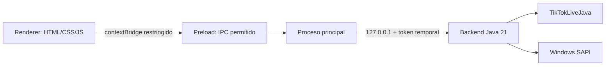

# Live Chat TTS - Frontend de escritorio

<p align="center"></p>

[](README.md)
[](https://www.electronjs.org/)
[](https://nodejs.org/)
[](#requisitos)
[](#compilación-de-producción)

Cliente de escritorio Electron compacto para el backend Java local. Se conecta a un LIVE de TikTok por usuario, muestra conexión y cola, entrega los comentarios al backend y visualiza cuándo SAPI está hablando.

## Arquitectura



### Límites de seguridad

- `contextIsolation` activado, `nodeIntegration` desactivado y renderer en sandbox.
- El renderer no tiene acceso al sistema de archivos, procesos, Java ni token.
- `preload.cjs` expone únicamente operaciones IPC explícitas.
- Electron inicia Java en un puerto loopback aleatorio con token por ejecución.
- Se bloquean navegación externa y apertura de ventanas.

## Funcionalidades

- Campo `uniqueId` de TikTok con estado de conexión y desconexión.
- Modo de prueba local con botón **Probar voz**.
- Selección de voz SAPI, velocidad y salida de audio predeterminada de Windows.
- Logo de voz animado mientras la cola reproduce mensajes.
- Cola acotada y límites de recursos visibles como métricas.
- Ajustes persistidos localmente por el backend; no se guarda historial del chat.

## Requisitos

- Windows 10/11 x64.
- Node.js 20 o superior y npm para desarrollo.
- JAR de producción en `../backend/dist/live-chat-tts.jar`.
- Java no es necesario en la computadora destino al usar el instalador: se incluye un runtime Java 21 reducido en `resources/jre`.

## Desarrollo

Instala las dependencias en el `node_modules` local del proyecto:

```bat
cd path\to\live-chat-tts\frontend
npm install
```

Prueba offline la interfaz y SAPI:

```bat
test-ui.bat
```

Ejecuta el modo real de TikTok:

```bat
run.bat
```

El frontend usa `TIKTOK_LIVE_JAVA` por defecto; `test-ui.bat` lo cambia a `LOCAL_TEST`.

### Evaluación de Piper

Después de ejecutar `backend\\setup-piper.bat`, inicia la misma interfaz con la voz local Piper `es_MX-claude-high`:

```bat
test-piper-ui.bat
```

Este script de evaluación establece `TTS_ENGINE=PIPER`; no crea un instalador ni cambia el motor SAPI predeterminado.

## Compilación de producción

Primero genera el JAR desde `backend\\` usando `build.bat`. Después crea el runtime Java y el instalador Windows:

```bat
cd path\to\live-chat-tts\frontend
prepare-runtime.bat
npm run dist-win
```

Electron Builder usa `asar`, `extraResources` y destino NSIS. El instalador incluye:

- Archivos de la aplicación Electron.
- `backend/live-chat-tts.jar` fuera de `app.asar`.
- `jre/` con el runtime Java 21 reducido.

Por defecto, el instalador queda en `dist\\`.

## Estructura del proyecto

```text
frontend/
├── src/
│   ├── assets/                 # Logo de marca
│   ├── main.cjs                # Proceso principal y ciclo de Java
│   ├── preload.cjs             # Puente IPC restringido
│   └── renderer/               # Interfaz, estilos y consulta de estado
├── prepare-runtime.bat         # Crea el runtime Java 21 incluido
├── run.bat                     # Inicia modo TikTok
└── test-ui.bat                 # Inicia modo offline LOCAL_TEST
```

## Solución de problemas

- `No se encontró el JAR`: genera primero `backend\\dist\\live-chat-tts.jar`.
- No aparecen voces: comprueba las voces SAPI de Windows y ejecuta el frontend en Windows.
- Error de conexión: verifica que la cuenta esté LIVE y revisa el estado del backend; TikTokLiveJava es una integración no oficial y su comportamiento puede cambiar.
- Si una instancia anterior bloquea la salida, ciérrala y vuelve a ejecutar `npm run dist-win`.

## Licencia y avisos de terceros

El frontend es software de escritorio local. Electron y Electron Builder conservan sus respectivas licencias. TikTokLiveJava es una dependencia MIT independiente incluida en el JAR del backend.
