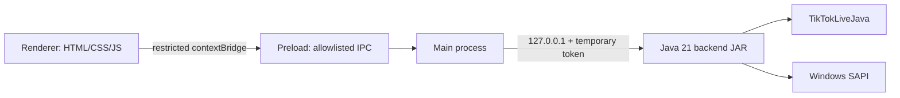

# Live Chat TTS - Desktop Frontend

<p align="center"></p>

[](README.es.md)
[](https://www.electronjs.org/)
[](https://nodejs.org/)
[](#requirements)
[](#production-build)

Compact Electron desktop client for the local Java backend. It connects to a TikTok LIVE by username, displays connection and queue status, sends comments to the backend, and visualizes when SAPI is speaking.

## Architecture



### Security boundaries

- `contextIsolation` is enabled, `nodeIntegration` is disabled and the renderer is sandboxed.
- The renderer has no filesystem, process, Java or token access.
- Only explicit IPC operations are exposed through `preload.cjs`.
- Electron starts Java on a random loopback port with a per-run token.
- External navigation and window opening are denied.

## Features

- TikTok `uniqueId` input with connect/disconnect state.
- Local test mode with a **Probar voz** action.
- SAPI voice selection, speech rate and Windows default audio output settings.
- Animated voice logo while the queue is speaking.
- Bounded queue and backend resource limits visible as metrics.
- Settings persisted locally by the backend; no chat history is stored.

## Requirements

- Windows 10/11 x64.
- Node.js 20+ and npm for development.
- A production backend JAR at `../backend/dist/live-chat-tts.jar`.
- Java is not required on the target computer when using the packaged installer: a reduced Java 21 runtime is bundled under `resources/jre`.

## Development

Install dependencies into the project-local `node_modules`:

```bat
cd path\to\live-chat-tts\frontend
npm install
```

Run an offline UI/SAPI smoke test:

```bat
test-ui.bat
```

Run the real TikTok mode:

```bat
run.bat
```

The frontend defaults to `TIKTOK_LIVE_JAVA`; `test-ui.bat` overrides it to `LOCAL_TEST`.

## Production build

Build the backend first from `backend\\` with `build.bat`. Then create the Java runtime and Windows installer:

```bat
cd path\to\live-chat-tts\frontend
prepare-runtime.bat
npm run dist-win
```

Electron Builder uses `asar`, `extraResources` and an NSIS target. The installer includes:

- Electron application files.
- `backend/live-chat-tts.jar` outside `app.asar`.
- `jre/` with the reduced Java 21 runtime.

The installer is written to `dist\\` by default.

## Project layout

```text
frontend/
├── src/
│   ├── assets/                 # Brand logo
│   ├── main.cjs                # Electron main process and Java lifecycle
│   ├── preload.cjs             # Narrow IPC bridge
│   └── renderer/               # Small UI, styles and state polling
├── prepare-runtime.bat         # Creates the bundled Java 21 runtime
├── run.bat                     # Starts TikTok mode
└── test-ui.bat                 # Starts offline LOCAL_TEST mode
```

## Troubleshooting

- `No se encontró el JAR`: build `backend\\dist\\live-chat-tts.jar` first.
- No voices listed: verify Windows SAPI voices and run the frontend on Windows.
- Connection errors: confirm the account is LIVE and review the backend status; TikTokLiveJava is an unofficial integration whose behavior can change.
- If a previous app instance locks a build output, close it and run `npm run dist-win` again.

## License and third-party notices

The frontend is local desktop software. Electron and Electron Builder retain their respective licenses. TikTokLiveJava is a separate MIT-licensed dependency included in the backend JAR.
